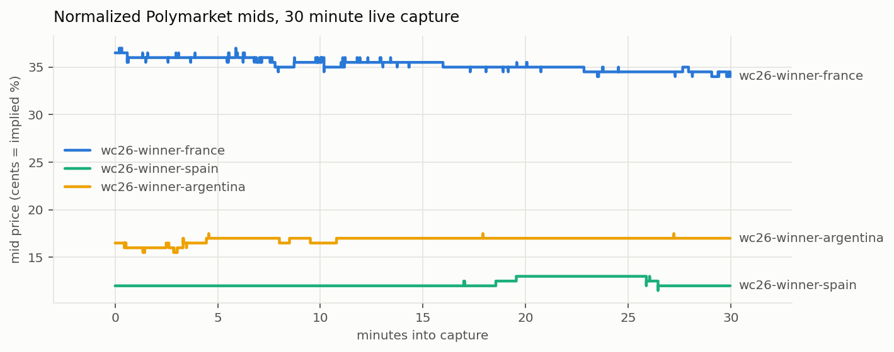
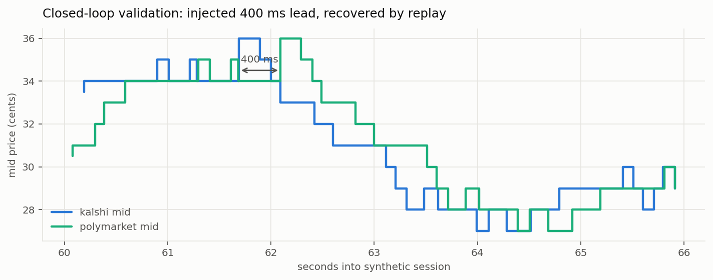

# basis

A real-time, cross-venue market-data engine in C++20. It ingests live order
books for the same real-world event from two structurally different prediction
markets, normalizes them into one schema, and measures the price *lead* of one
venue over the other.

- **Kalshi** is a CFTC-regulated, USD-denominated, centralized exchange.
- **Polymarket** runs on crypto rails (USDC): an off-chain order book with
  on-chain settlement on Polygon.

They list contracts on the same outcomes but have different participant bases,
capital efficiency, and settlement rails, so their prices diverge and one tends
to move first. `basis` measures that lead in real time, over an engine built
for low internal latency and zero message loss.



The engine's normalized view of real markets: 2026 World Cup winner books
from the committed 30 minute live capture (`docs/bench/latency.md`), venue
probability strings turned into one canonical cents-per-contract frame.
Figures regenerate from the committed capture with
`scripts/plot_bench.py`.

## Status

The engine runs end to end, offline and live: real venue wire formats are
parsed, normalized into per-event unified books, and measured for basis,
lead-lag, and per-record ingest-to-signal latency, driven either by
deterministic replay or by `basis live` streaming the venues in real
time. Both live feeds sit behind the same `FeedAdapter` seam: Polymarket
records real sessions over TLS WebSocket, and the Kalshi adapter (signed
session, gap-triggered re-snapshot) is verified offline down to the RSA-PSS
signature and waits only on account credentials for its first live capture.
The hot path is zero-copy and allocator-instrumented, benchmarked against
Bloomberg's BDE arenas (`docs/bench/allocator.md`). See `PLAN.md` for the
full spec and `docs/design.md` for how the code is put together.

## Build and run

```
cmake -B build -G Ninja
cmake --build build -j
ctest --test-dir build --output-on-failure
```

Try it without any credentials or network: generate a synthetic session with
a known injected cross-venue lead, then replay it through the full pipeline
and watch the engine report that lead back.

```
./build/src/basis synth captures/demo.feedlog --steps 5000 --lead-ms 400
./build/src/basis replay captures/demo.feedlog
```

The replay prints message accounting (nothing is ever silently dropped),
per-event basis statistics, the recovered lead with a bootstrap confidence
interval and an independent event-study cross-check, and ingest-to-signal
latency percentiles. The same closed loop runs in the test suite and in
CI's performance gate: if the engine cannot recover an injected lead
through the real parsers, by both methods, the build is red.



That injected lead is visible to the eye in the synthetic session itself:
the same random walk quoted by both synthetic venues, one of them 400 ms
behind. Replay reports 0.400 s with correlation 1.00.

The configure pulls GoogleTest and simdjson. With `-DBASIS_ENABLE_BDE=ON`
(`brew install bde` on macOS), `replay --alloc bde` runs the hot path on
Bloomberg `bdlma` arenas and `--alloc count` reports heap traffic per
message; `docs/bench/allocator.md` records what those measured.
`replay --breakdown` splits the ingest-to-signal time into parse versus
everything downstream (normalize, book apply, analytics, publish); on the
synthetic session parse is about 60% (simdjson plus canonicalization),
the rest of the pipeline the other 40%.

## Live capture

With `-DBASIS_ENABLE_NET=ON` (needs system Boost and OpenSSL), `basis
record` connects to Polymarket's public market WebSocket, no credentials
required, subscribes to every contract in the registry, and captures the
raw feed:

```
cmake -B build-net -G Ninja -DBASIS_ENABLE_NET=ON
cmake --build build-net -j
./build-net/src/basis record captures/live.feedlog --seconds 60
./build-net/src/basis replay captures/live.feedlog --config configs/contracts.toml
```

`configs/contracts.toml` maps real cross-venue contracts (2026 World Cup
winners, Fed decisions) between Kalshi tickers and Polymarket token ids.

Kalshi requires an authenticated session even for market data (free
account + RSA API key). With credentials, the same command captures both
venues into one feedlog:

```
./build-net/src/basis record captures/live.feedlog --seconds 60 \
    --kalshi-key-id <your-key-id> --kalshi-pem secrets/kalshi.pem
```

The key file lives under gitignored `secrets/` and never enters the repo.
Until both venues stream, replay reports each event's one-sided book and
flags the missing overlap rather than inventing a basis.

`basis live` runs the analytics in real time instead of capturing: feed
IO threads hand owned deltas to a bounded queue drained by one analytics
thread, and per-event basis prints as the books move. The exit report
includes the queue accounting (in, out, high water, blocked pushes), so
zero message loss across the thread boundary is measured, not assumed:

```
./build-net/src/basis live --seconds 60
```

## Design at a glance

```
feed (Kalshi, Polymarket)  ->  normalize + match  ->  unified order book
                                                            |
                                                       analytics
                                                  (divergence, lead-lag)
                                                            |
                                          BLPAPI-style subscription API
```

The hot parse-and-normalize path is zero-copy (market ids are views into
the parser buffer) and every allocation site draws from an injectable
`std::pmr` resource. Bloomberg's open-source BDE (`bdlma`) arenas plug
into those seams; measured against the global heap they came out at
parity, because the zero-copy path leaves only 1-2 allocations per message
(`docs/bench/allocator.md`), so the heap default ships. The consumer
interface mirrors Bloomberg's BLPAPI subscription model. Internal
ingest-to-signal latency is measured by deterministic replay (network
jitter removed) and reported in percentiles.

Note: this project uses Bloomberg's open-source libraries and API design. It
does not use Bloomberg data, which is licensed and not redistributable. The
only market data here comes from Kalshi's and Polymarket's public APIs.

## Layout

```
src/core/       logging, clocks, hashing, counting allocator, portable rng
src/model/      canonical schema: venue, side, order book, unified book
src/feed/       venue parsers, live feed adapters, feedlog capture format
src/normalize/  cross-venue contract registry + event router (NO-side fold)
src/analytics/  divergence, cross-correlation lead-lag, event study
src/api/        BLPAPI-style subscription interface
src/bench/      replay harness, latency recorder, synthetic sessions
src/net/        TLS WebSocket client + Kalshi request signing
src/alloc/      Bloomberg bdlma arenas behind a std::pmr seam
tests/          GoogleTest unit and integration tests
configs/        contract registries (real + synthetic)
docs/           design notes, venue API notes, benchmark artifacts
scripts/        CI performance gate, README figure generator
```

## Numbers

Filled in only from committed benchmarks, never aspirational (the same rule the
companion voxel-engine project follows). Recorded so far:

- `docs/bench/latency.md`: on a committed 30-minute live capture (34,731
  messages, 266,597 deltas, zero loss), ingest-to-signal latency is
  p50 0.5 us / p99 37 us at ~840k records/sec, stable across runs.
- `docs/bench/soak.md`: four unattended hours live (59,891 messages, 49 MB),
  3 natural venue disconnects survived, zero malformed, zero rejected,
  zero gaps; same latency percentiles as the shorter capture, so the
  numbers are properties of the engine, not of one lucky recording.
- `docs/bench/allocator.md`: hot path at 1-2 heap allocations per message,
  3.7M records/sec max-rate synthetic replay on an Apple M4, bdlma arenas
  at parity with the global heap.
- `scripts/perf_gate.sh` runs in CI on every commit: lead recovery exact,
  integrity counters zero, allocation budget held, throughput floor with
  10x headroom. It reads `replay --json`, so a change to the human report
  format cannot silently break the gate.
- `tests/test_reconnect.cpp` runs in CI on every commit: 4 forced
  mid-subscription TCP drops against a fault-injecting local server, and
  the feed stack must rebuild the book to ground truth with every drop
  counted, TLS peer and hostname verification on throughout.
- `fuzz/` runs in CI on every commit: libFuzzer on both venue parsers and
  the registry parser under ASan and UBSan, 100k executions per target
  per commit, 2M per target in local deep runs, zero findings in project
  code to date.
- Venue integrity hashes are recomputed, not trusted: the parser rebuilds
  Polymarket's canonical book summary and checks its SHA-1 on every
  snapshot that carries the hashed fields, 13/13 verified with 0
  mismatches on the committed capture (docs/api_integration.md has the
  recipe).

The cross-venue lead measurement waits on a simultaneous both-venue
recording (Kalshi credentials); until then that figure stays a bracketed
placeholder in `PLAN.md`.
