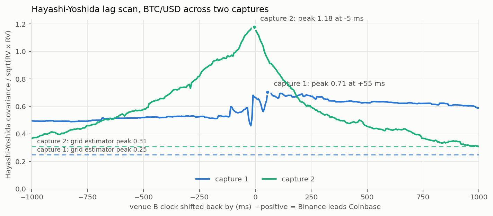
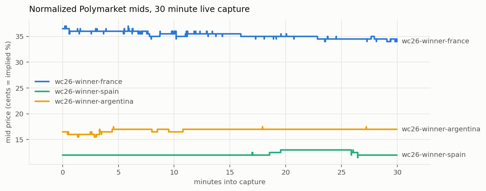
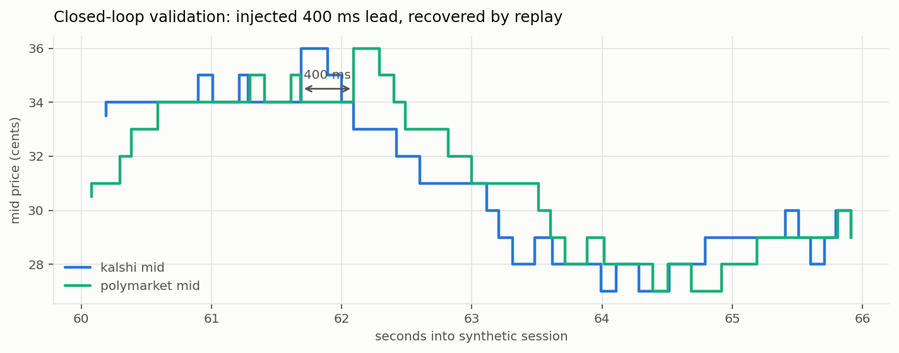

# basis

A real-time, cross-venue market-data engine in C++20. It reads live order
books from several venues over TLS WebSocket, normalizes them into one
schema, and serves them to consumers through a BLPAPI-style interface -
subscription and request, both entitlement-checked.

That is four pieces, and the middle two are the ones a market-data team
spends its time on:

  **feed handlers.** Four venue parsers behind one adapter seam, each
  turning a venue's own dialect into one canonical delta. Sequence gaps
  are detected and answered by dropping the book and re-requesting a
  snapshot, because a book known to be stale must never be served.
  **normalization.** Venue-native market ids disappear at the registry;
  everything downstream is keyed by a venue-neutral event id.
  **distribution.** Conflated fan-out, so a slow consumer receives the
  current price rather than a backlog, with memory bounded by subscribers
  times topics rather than by publish rate.
  **entitlements.** Default-deny, granted per subscriber and per topic,
  enforced identically on push and pull, with denials counted rather than
  merely prevented.

On top of that it measures which venue's price moves first.

**The measured result: a repricing on Binance is answered by Coinbase far
more often than the reverse, and it now holds on two instruments at once.**
A 29 minute capture carrying BTC and ETH quoted by both venues confirms
the ordering separately on each, under identical market conditions: BTC at
z = 5.19 and ETH at z = 9.43, with Binance's moves answered roughly four
times as often as Coinbase's on both. The second instrument is a control
on the first rather than a separate study, which is the strongest form
this claim has taken.

It also replicates across sessions. Across two earlier 45 minute captures
of Binance and Coinbase quoting BTC, Binance was answered 0.577 of the
time against Coinbase's 0.264 in the first session
(z = 11.76, 204,864 messages) and 0.903 against 0.539 in a second session
eight days later that was three times as busy (z = 39.33, 642,919
messages). The ordering holds at every threshold from $0.25 to $2.00 in
both, and the measurement is biased *against* that conclusion by roughly
36 to 86 ms of network asymmetry.

The follow rates themselves do **not** replicate - both roughly doubled in
the busier session, because a two second window catches more coincidence
when the market is moving constantly. So the claim is the ordering and its
significance, not a percentage: those describe one afternoon.

**A third estimator says why the other two could only ever report an
ordering.** Hayashi-Yoshida is the standard covariance estimator for
prices observed at different, irregular times: it pairs returns over
overlapping observation intervals instead of resampling both venues onto
a common grid. Run on the same two captures, it finds a co-movement of
0.71 and 1.18 where the grid estimator found 0.25 and 0.31 - the grid was
recovering roughly a quarter to a third of what is in these books, and
throwing the rest away as synchronization bias before it measured
anything. That gap replicates across both captures. The millisecond-scale
*direction* does not survive the same scrutiny, and the writeup says so
rather than picking the capture that agreed.



Full methodology, all three estimators, the replication, and the bias
budget: [`docs/bench/cross_venue_lead.md`](docs/bench/cross_venue_lead.md).

Both sockets are read by one process so the two streams share a clock,
which is the detail that makes the measurement possible at all - two
processes, or two clocks, would put an unknown offset directly into the
quantity being estimated:

```
basis record out.feedlog --binance btcusdt --coinbase BTC-USD --seconds 2700
basis xvenue-lead out.feedlog
```

**Contents:** [What it was built for](#what-it-was-built-for-and-where-that-stands)
- [Status](#status) - [Build and run](#build-and-run)
- [Live capture](#live-capture) - [Design](#design-at-a-glance)
- [Layout](#layout) - [Numbers](#numbers)

Start with [Build and run](#build-and-run) if you want to see it work: it
generates a synthetic session with a known cross-venue lead injected and
replays it through the real parsers, with no network and no credentials.

## What it was built for, and where that stands

The original target is a pair of prediction markets rather than two crypto
exchanges:

- **Kalshi** is a CFTC-regulated, USD-denominated, centralized exchange.
- **Polymarket** runs on crypto rails (USDC): an off-chain order book with
  on-chain settlement on Polygon.

They list contracts on the same outcomes with different participant bases,
capital efficiency, and settlement rails, so their prices diverge and one
tends to move first. That pairing is why the engine normalizes across
venues at all, and the contract registry maps real cross-venue contracts
between Kalshi tickers and Polymarket token ids.

Prediction-market contracts resolve, so a registry of them has a shelf
life. The 14 in `configs/contracts.toml` were matched in July 2026 and
have all since settled; that file is kept because the committed captures
carry its token ids. `configs/contracts-live.toml` is the current one and
`scripts/contracts.py check` says whether it still is.

**It has not been measured, and the reason is credentials, not code.**
Polymarket's market channel is public and is captured live here
(`docs/bench/latency.md` is a committed 30 minute session). Kalshi requires
an authenticated session even for market data, and this repo has never had
an account: the Kalshi adapter - signed session, gap-triggered
re-snapshot - is verified offline down to the RSA-PSS signature and waits
on a key. Binance and Coinbase are the pairing that is public on both
sides, which is why the real cross-venue result above is crypto rather
than prediction markets.

That distinction is kept sharp everywhere in this repo: a figure is either
measured on a committed capture or it is labelled as not yet measured.

One scope limit belongs next to it. This is a **book** engine: it carries
price levels and not trade prints. Every venue here publishes trades on
the same socket, and the Coinbase parser can already read a `ticker`
frame, but the live feed subscribes to `level2_batch` for depth, so no
committed capture contains a single trade. Nothing in the analytics
infers one. That is a real gap rather than a decision, and it is the
largest one left in what the engine models.



The engine's normalized view of real markets: 2026 World Cup winner books
from the committed 30 minute live capture (`docs/bench/latency.md`), venue
probability strings turned into one canonical cents-per-contract frame.
Figures regenerate from the committed capture with
`scripts/plot_bench.py`.

## Status

The engine runs end to end, offline and live: real venue wire formats are
parsed, normalized into per-event unified books, and measured for basis,
lead-lag, and per-record ingest-to-signal latency, driven either by
deterministic replay or by `basis live` streaming the venues in real
time. Four venue parsers (Kalshi, Polymarket, Binance, Coinbase) sit
behind one `FeedAdapter` seam. The hot path is zero-copy and
allocator-instrumented, benchmarked against Bloomberg's BDE arenas
(`docs/bench/allocator.md`). A price-time-priority matching engine
(`docs/bench/matching_engine.md`) runs both as a throughput benchmark and
as an independent check on the analytics. Things that broke along the way,
and how they were found, are written up in
[`docs/postmortems.md`](docs/postmortems.md). See `PLAN.md` for the full
spec and `docs/design.md` for how the code is put together.

## Build and run

```
cmake -B build -G Ninja
cmake --build build -j
ctest --test-dir build --output-on-failure
```

Try it without any credentials or network: generate a synthetic session with
a known injected cross-venue lead, then replay it through the full pipeline
and watch the engine report that lead back.

```
./build/src/basis synth captures/demo.feedlog --steps 5000 --lead-ms 400
./build/src/basis replay captures/demo.feedlog
```

The replay prints message accounting (nothing is ever silently dropped),
per-event basis statistics, the recovered lead with a bootstrap confidence
interval and an independent event-study cross-check, and ingest-to-signal
latency percentiles. The same closed loop runs in the test suite and in
CI's performance gate: if the engine cannot recover an injected lead
through the real parsers, by both methods, the build is red.



That injected lead is visible to the eye in the synthetic session itself:
the same random walk quoted by both synthetic venues, one of them 400 ms
behind. Replay reports 0.400 s with correlation 1.00.

The configure pulls GoogleTest and simdjson. With `-DBASIS_ENABLE_BDE=ON`
(`brew install bde` on macOS), `replay --alloc bde` runs the hot path on
Bloomberg `bdlma` arenas and `--alloc count` reports heap traffic per
message; `docs/bench/allocator.md` records what those measured.
`replay --breakdown` splits the ingest-to-signal time into parse versus
everything downstream (normalize, book apply, analytics, publish); on the
synthetic session parse is about 60% (simdjson plus canonicalization),
the rest of the pipeline the other 40%.

## Live capture

With `-DBASIS_ENABLE_NET=ON` (needs system Boost and OpenSSL), `basis
record` connects to Polymarket's public market WebSocket, no credentials
required, subscribes to every contract in the registry, and captures the
raw feed:

```
cmake -B build-net -G Ninja -DBASIS_ENABLE_NET=ON
cmake --build build-net -j
./build-net/src/basis record captures/live.feedlog --seconds 60
./build-net/src/basis replay captures/live.feedlog --config configs/contracts.toml
```

There are two registries, and the split matters. `configs/contracts.toml`
maps the contracts the **committed captures** were recorded against, in
July 2026 - 2026 World Cup winners and the July Fed decision. All of them
have since resolved, so it captures nothing today and is kept only because
replaying `docs/bench/*.feedlog.gz` needs exactly those ids.

`configs/contracts-live.toml` is the one `record` and `live` default to,
generated from what is currently trading. It rots the same way, just
later, so check it before a capture:

```
scripts/contracts.py check configs/contracts-live.toml
scripts/contracts.py refresh -o configs/contracts-live.toml
```

That check exists because of how the rot presents: a registry of resolved
contracts and a market where nothing is trading both produce zero
messages, and nothing about an empty capture says which one happened. The
old registry went stale unnoticed and `basis live` printed one message in
twenty-five seconds before anyone asked why.

Kalshi requires an authenticated session even for market data (free
account + RSA API key). With credentials, the same command captures both
venues into one feedlog:

```
./build-net/src/basis record captures/live.feedlog --seconds 60 \
    --kalshi-key-id <your-key-id> --kalshi-pem secrets/kalshi.pem
```

The key file lives under gitignored `secrets/` and never enters the repo.
Until both venues stream, replay reports each event's one-sided book and
flags the missing overlap rather than inventing a basis.

`basis live` runs the analytics in real time instead of capturing: feed
IO threads hand owned deltas to a bounded queue drained by one analytics
thread, and per-event basis prints as the books move. The exit report
includes the queue accounting (in, out, high water, blocked pushes), so
zero message loss across the thread boundary is measured, not assumed:

```
./build-net/src/basis live --seconds 60
```

## Design at a glance

```
feed (Kalshi, Polymarket)  ->  normalize + match  ->  unified order book
                                                            |
                                                       analytics
                                        (divergence, lead-lag, microprice,
                                         crossed-book economics net of fees
                                         and of reaction delay)
                                                            |
                                     BLPAPI-style subscription + request API

matching engine (exec/)  ->  price-time priority book, Gtc/Ioc/Fok
                             cross-checks the analytics by executing
                             the same sweeps as order flow
```

The consuming path above is one direction; `exec/` is the other. It is a
price-time-priority matching engine whose ladder is a flat 99-slot array
because prediction-market prices are integer cents, and it exists for
more than completeness: the arbitrage numbers the analytics report are
recomputed by executing the same sweeps through it as order flow, so the
two must agree (`docs/bench/matching_engine.md`).

The hot parse-and-normalize path is zero-copy (market ids are views into
the parser buffer) and every allocation site draws from an injectable
`std::pmr` resource. Bloomberg's open-source BDE (`bdlma`) arenas plug
into those seams; measured against the global heap they came out at
parity, because the zero-copy path leaves only 1-2 allocations per message
(`docs/bench/allocator.md`), so the heap default ships. The consumer
interface mirrors both halves of Bloomberg's BLPAPI model.

**Subscription** is push: a consumer names the topics it cares about and
values arrive, conflated, so a slow one receives the current price rather
than a backlog. **Request** is pull: it asks for a topic's current value
and gets it immediately, which is what a screen needs when it opens
instead of waiting for the next tick.

Entitlements are enforced identically on both, which is the point rather
than a detail - a pull path that skipped the check would be a way around
it, and that is how licensed data leaks in practice. A refusal is also
deliberately indistinguishable from a topic that does not exist, because
"that exists but you may not see it" is itself an answer the caller was
not entitled to, and telling them apart would let a caller enumerate the
topic space. Both outcomes are counted, so "nobody was served what they
should not have been" is evidenced rather than asserted.
 Internal
ingest-to-signal latency is measured by deterministic replay (network
jitter removed) and reported in percentiles.

Note: this project uses Bloomberg's open-source libraries and API design. It
does not use Bloomberg data, which is licensed and not redistributable. The
only market data here comes from Kalshi's and Polymarket's public APIs.

## Layout

One directory per library, and the dependency order below is enforced
rather than described: `scripts/levelize.py` runs in CI before the build
and fails on a cycle, on a package dependency that is not declared, or on
a directory that spans two levels.

```
level 1  src/core/       logging, clocks, hashing, counting allocator, portable rng
         src/model/      canonical schema: venue, side, order book, unified book
         src/alloc/      Bloomberg bdlma arenas behind a std::pmr seam

level 2  src/feed/       venue parsers (Kalshi, Polymarket, Binance, Coinbase),
                         book sequencer, feedlog capture format
         src/normalize/  contract registry, event router (NO-side fold),
                         cross-venue crypto instrument naming
         src/analytics/  divergence, cross-correlation and
                         Hayashi-Yoshida lead-lag, event study
         src/api/        BLPAPI-style interface: subscription + request
         src/exec/       price-time-priority matching engine, order index
         src/net/        TLS WebSocket client + Kalshi request signing

level 3  src/bench/      replay harness, latency recorder, synthetic sessions,
                         stats reporting
         src/feed_live/  WSS adapters per venue (needs net/; BASIS_ENABLE_NET)

level 4  src/cli/        one function per subcommand, grouped by what it
                         needs: microbenchmarks, capture analysis, live
                         sockets. The composition root, and the only
                         package allowed to see everything

         src/main.cpp    29 lines: maps a subcommand name onto a function
```

`feed/` and `feed_live/` were one directory until `levelize.py` pointed
out that it spanned two levels: the offline parse path has no business
pulling in Boost and OpenSSL, and now it does not. `cli/` is the same
idea applied to `main.cpp`, which had reached 1,400 lines and three times
the size of any other file here.

```
tests/          GoogleTest unit and integration tests
fuzz/           libFuzzer targets + corpus for the parsers and registry
configs/        contract registries (real + synthetic)
cmake/          dependency, warning, and sanitizer toolchain fragments
docs/           design notes, venue API notes, benchmark artifacts
scripts/        CI performance gate, levelization check, benchmark runner,
                README figure generator
```

## Numbers

Filled in only from committed benchmarks, never aspirational (the same rule the
companion voxel-engine project follows). `scripts/bench.sh` regenerates the
summary below from the committed capture artifacts through `replay --json`, so
every figure traces to one command. Recorded so far:

- `docs/bench/book_reconstruction.md`: consuming a venue API is not the
  hard part; knowing that the book you assembled is the book the venue has
  is. `feed::BookSequencer` implements snapshot-and-diff reconciliation
  (buffer before the snapshot, discard what it already contains, require
  the first event to straddle it, then demand unbroken `U == prev u + 1`),
  and `basis book-verify` proves it on a committed live capture: 230
  events applied in sequence, and the reconstructed book matches the
  venue's own independently taken REST snapshot on all 40 compared levels
  with zero mismatches, at exactly the same sequence id. CI runs it on
  every commit.
- `docs/bench/ingest.md`: the prediction markets are slow, about 19
  messages/sec on the committed capture, which makes a latency number hard
  to interpret. So the engine also ingests Binance, which is there because
  it produces load: 90 seconds of live public market data across 94
  symbols, 24,048 messages with zero malformed. The venue sustains 269
  messages/sec; the same pipeline parses and applies them at 2,189,981/sec,
  8.2M deltas/sec. Four orders of magnitude of headroom, *on the average
  rate* - which is not the rate anything arrives at, see the latency entry
  below. (This was 932,471/sec until a book-correctness fix; see the
  cross-venue entry below.)
- `docs/bench/cross_venue_lead.md`: the first lead-lag measurement in this
  repo taken on a real market rather than a synthetic session with a lead
  injected on purpose. Binance BTCUSDT against Coinbase BTC-USD, both
  sockets read by one process (`basis record --binance btcusdt --coinbase
  BTC-USD`) so the two streams share a clock, 45 minutes
  and 204,864 messages with zero malformed. A repricing on Binance is
  answered by Coinbase 57.7% of the time; one on Coinbase is answered by
  Binance 26.4% of the time (two-proportion z = 11.76), and the gap holds
  at every threshold from $0.25 to $2.00. The measurement is biased
  *against* that result: this host sits about 86 ms farther from Binance
  than from Coinbase, which both suppresses the forward follow rate and
  inflates the reverse one. Building it also exposed a real bug in shipped
  code - `bookTicker` replaces the touch, but the parser emitted it as
  plain level updates, so the book accumulated stale levels until the
  spread went to minus $54.87. Throughput benchmarks cannot see a wrong
  book; a measurement that reads prices out of one can.
- `docs/bench/latency.md`: on a committed 30-minute live capture (34,731
  messages, 266,597 deltas, zero loss), ingest-to-signal latency is
  p50 0.8 us / p99 78 us at ~458k records/sec, stable across runs. Those
  are **service** times from a back-to-back replay, and replaying the
  capture at its own arrival schedule instead shows what that costs:
  the p99 a consumer of the feed actually waits is **13x higher**
  (116 us service against 1,534 us response, same run), because a loop
  that never waits also never samples the stall it is in - coordinated
  omission. The same experiment found the engine genuinely behind on
  **one record in seven** at the venue's real rate, despite averaging 19
  messages/sec against a 458k/sec pipeline: 41% of this feed's
  inter-arrival gaps are under 100 microseconds, so the mean rate
  describes nothing that happens.
- `docs/bench/soak.md`: four unattended hours live (59,891 messages, 49 MB),
  3 natural venue disconnects survived, zero malformed, zero rejected,
  zero gaps; same latency percentiles as the shorter capture, so the
  numbers are properties of the engine, not of one lucky recording.
- `docs/bench/allocator.md`: hot path at 1-2 heap allocations per message,
  3.7M records/sec max-rate synthetic replay on an Apple M4, bdlma arenas
  at parity with the global heap.
- `scripts/perf_gate.sh` runs in CI on every commit: lead recovery exact,
  integrity counters zero, allocation budget held, throughput floor with
  10x headroom. It reads `replay --json`, so a change to the human report
  format cannot silently break the gate.
The failure this exists for is not a socket that errors. It is one that
does not: a peer or a middlebox that vanishes without a FIN or an RST
leaves a blocking read parked forever, and the reconnect path is driven by
read errors, so it never runs. That is not hypothetical here - a 45 minute
capture has Coinbase going silent 19 minutes in and staying silent for the
remaining 25, with **zero reconnects logged**, while Binance recovered
twice over the same outage because its server does close connections.
Beast's own `stream_base::timeout` does not cover it: those settings apply
to asynchronous operations and this client reads synchronously, and
`keep_alive_pings` has no effect while `idle_timeout` is `none`, which is
the client-role default. So the guard is external - a watchdog thread that
breaks the read the same way `stop()` does.

- `tests/test_reconnect.cpp` runs in CI on every commit: 4 forced
  mid-subscription TCP drops against a fault-injecting local server, and
  the feed stack must rebuild the book to ground truth with every drop
  counted, TLS peer and hostname verification on throughout.
- `fuzz/` runs in CI on every commit: libFuzzer on both venue parsers and
  the registry parser under ASan and UBSan, 100k executions per target
  per commit, 2M per target in local deep runs, zero findings in project
  code to date.
- `scripts/levelize.py` runs in CI before the build: a physical-design
  check over the `src/` include graph in the Lakos sense, failing on any
  component cycle, package cycle, or package dependency not declared to
  match what each library links. It caught a real one on its first run,
  where a single directory spanned two link-time tiers
  (`docs/design.md`).
- `docs/bench/fanout.md`: the consumer side of distribution. A synchronous
  session runs handlers on the publisher's thread, so the slowest consumer
  sets the publisher's rate: with one 50-microsecond handler the publisher
  is pinned near 20,000 updates/sec at every fan-out size, which is exactly
  1 / 50 microseconds. `api::ConflatingSession` gives each subscriber one
  slot per topic instead of a queue, so publishers never wait on consumers
  and memory is bounded by subscribers times topics rather than by publish
  rate. At 16 subscribers the publisher runs roughly 40 to 46x faster (777k to
  899k updates/sec across runs; it is a throughput, so it moves with load),
  and every subscriber including the slow one ends holding the current
  value: conflation drops the stale middle, never the present. Joining is
  snapshot-then-stream: a consumer connecting mid-session is seeded with
  the current image under the same lock the publisher fans out beneath, so
  it can neither miss an update nor receive one older than a value already
  waiting for it.
- Entitlements are enforced on that same session, default-deny in
  `Restricted` mode, and the interesting half is revocation: an
  entitlement that lapses mid-session must drop the value already waiting
  in the subscriber's slot AND withhold one published in the race after
  the revoke, so the check runs both at `revoke()` and again at delivery
  (`docs/bench/fanout.md`).
- `docs/bench/matching_engine.md`: the price-time-priority book sustains
  42.6M operations/sec at 23.5 ns/op on an M4, 2.1x a textbook std::map
  book replaying identical order flow, with per-class tail latency
  reported honestly against the clock's 41.7 ns tick. Measuring that tail
  found the resting path's 320 us worst case in container growth;
  pre-sizing cut it to 34.6 us with identical medians. A passive-fill
  study over the same flow separates fills from never-fills by queue
  position at placement: 3,600 contracts ahead versus 126,234, a 35x
  split, with 80.4% of resting orders eventually trading.
- Crossable dislocations are priced as a ladder, each rung answering the
  question the previous one raises: how often the books cross, how long
  the episodes persist, how deep they run, what one taker order at the
  touch captures, what sweeping the full crossed depth captures, and what
  survives Kalshi's taker fee (ceil(0.07 * C * P * (1-P)), assumptions in
  `src/model/fees.h`). On the synthetic session the ladder inverts the
  headline: the gross sweep averages $1.13 per crossed update, but only
  109 of 537 crossed updates survive fees (net at the touch: mean -$0.36),
  while a taker free to decline losing fills keeps mean +$0.08, max
  +$1.45 - and the survival ladder times the decay: 100 ms of reaction
  delay leaves an expected $0.03 (59/210 episodes still crossed), 250 ms
  leaves $0.01 (8/210). Crossable is not profitable; selective and fast
  is. The fee and sweep arithmetic saturates on corrupt sizes the same
  way the book does (UBSan-verified), so a bad feed cannot poison the
  economics. Methodology and regeneration commands:
  `docs/bench/economics.md`.
- The mid is not fair value on a wide book, and the engine says so with
  numbers: it tracks queue imbalance and the size-weighted microprice at
  every touch. On the committed 30-minute capture, 11 of 13 two-sided
  events were bid-heavy and the microprice sat 7.99 cents above the mid
  on average, scaling with the spread (+9.9c on books quoted wider than
  20 cents, +1.7c on tighter ones). That qualifies every mid-based
  divergence statistic and says which events they can be trusted on; the
  crossable-dislocation ladder is unaffected because it never used mids,
  only executable bid and ask prices (`docs/bench/economics.md`).
- The engine also has the venue side: `src/exec/limit_order_book.h` is a
  price-time-priority matching engine (Gtc/Ioc/Fok, O(1) submit, cancel
  and best-price via a flat 99-slot ladder and two-word occupancy bit
  scan, because prediction-market prices are integer cents 1..99). It
  sustains 42.6M operations/sec at 23.5 ns/op on an M4, 2.1x a textbook
  `std::map` book replaying the identical order flow. Two correctness
  checks run in CI: the two books must produce identical fill streams over
  200k random operations, and executing a sweep as order flow through the
  engine must reproduce `crossed_sweep_cents` exactly, so the executable
  edge numbers are cross-checked rather than trusted
  (`docs/bench/matching_engine.md`).
- The complementary YES/NO bound is monitored, an invariant that exists
  only because these contracts settle at $0 or $1: the two sides are
  worth exactly $1.00 together, so any gap is riskless. On the committed
  30-minute capture it effectively never broke. Getting that answer took
  three attempts, and the failures are the interesting part: comparing
  prices as doubles manufactured 267 phantom violations (0.53 + 0.47
  exceeds 1.0 in floating point), and sampling per delta rather than per
  wire message manufactured more from states that exist only midway
  through applying one message (`docs/bench/economics.md`).
- Mutually exclusive outcome groups are watched as baskets on live data:
  best-bid sums are checked against the hard $1 no-arbitrage bound (valid
  even for partial baskets), mid-price sums read the venue's probability
  mass. On the committed 30-minute capture the Fed basket's mid-sum broke
  coherence for a moment ($1.40) while the tradable bid-sum never came
  within ten cents of the bound - quote noise and executable opportunity
  are different things, measured on live data
  (`docs/bench/economics.md`).
- Venue integrity hashes are recomputed, not trusted: the parser rebuilds
  Polymarket's canonical book summary and checks its SHA-1 on every
  snapshot that carries the hashed fields, 13/13 verified with 0
  mismatches on the committed capture (docs/api_integration.md has the
  recipe).

The cross-venue lead measurement waits on a simultaneous both-venue
recording (Kalshi credentials); until then that figure stays a bracketed
placeholder in `PLAN.md`.
